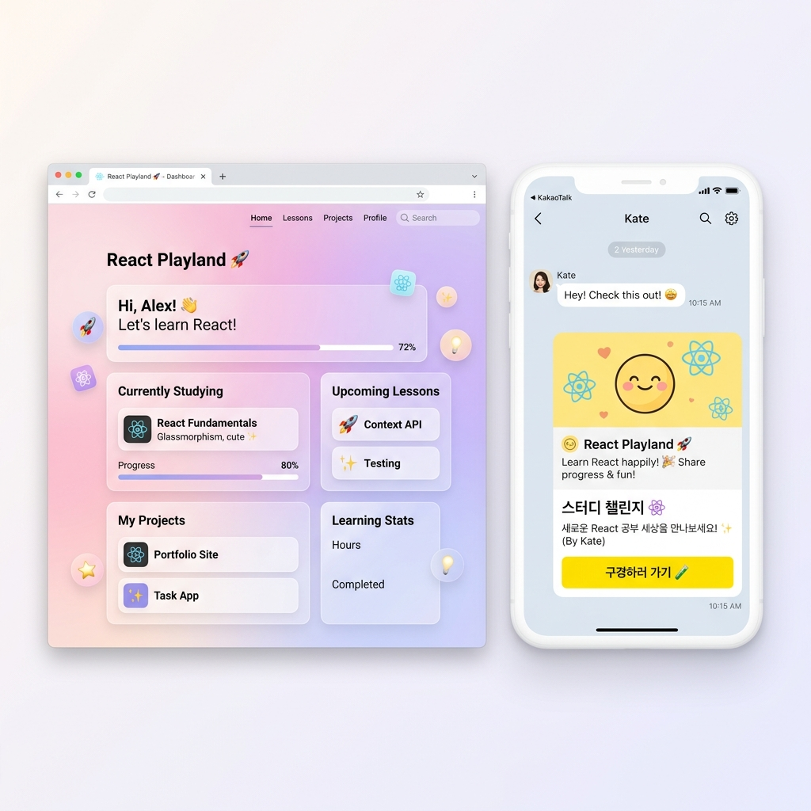

# React Playland 🚀✨ | My Cute Study Lab



리액트(React) 핵심 문법부터 파이어베이스(Firebase) 실시간 데이터베이스 연동까지!  
학습 과정에서 개발한 **5대 실전 프로젝트**와 **11대 핵심 강좌**를 한눈에 볼 수 있는 아기자기하고 예쁜 **리액트 학습 대시보드 홈페이지**입니다.

이 레포지토리의 첫 화면인 대시보드 홈페이지는 **부트스트랩(Bootstrap)**과 커스텀 애니메이션 디자인을 기반으로 제작되어 PC와 모바일 모두에서 최적화된 상태로 작동합니다.

---

## 🎨 대시보드 주요 기능 및 구성

### 1. 5대 실전 프로젝트 플레이그라운드
* **Project 01: Board Array 📝**: 리액트 컴포넌트 내부 상태(Array)만으로 구현한 로컬 CRUD 게시판.
* **Project 02: Board API 🌐**: 외부 Mock API 서버와 Fetch/Axios 비동기 통신을 적용한 연동 게시판.
* **Project 03: Live Comments 💬**: 꼼꼼한 폼 유효성 검사 기능이 내장된 실시간 댓글 피드.
* **Project 04: Scoreboard 🏆**: 실시간 플레이어 추가, 점수 증감, 순위 실시간 갱신용 스코어보드.
* **Project 05: KakaoTalk Clone 💛**: Firebase Firestore DB 연동을 적용한 실시간 다중 채팅방 메신저.

### 2. 학습 편의 위젯 & 진도 체크
* **동적 테마 체인저 🎨**: 핑크🌸, 민트🌿, 블루🌊, 퍼플👾 4가지 색상 테마를 실시간으로 스위칭하여 네온 글루 효과 적용.
* **강의 체크리스트 📊**: 11개의 실습 강좌(`react01` ~ `react11`) 완료를 체크하면 상단의 진행바가 실시간으로 차오릅니다. (브라우저 `localStorage` 연동)
* **개발자 메모장 📝**: 브라우저를 껐다 켜도 내용이 자동으로 복구되는 로컬 저장식 메모장.
* **카카오톡 공유하기 💬**: 친구들에게 내 리액트 대시보드 웹사이트 주소(해시 영역 포함)를 귀여운 피드 카드로 간편하게 보낼 수 있습니다.

---

## 🚀 로컬 실행 방법 (How to Run)

프로젝트를 실행하려면 비주얼 스튜디오 코드(VS Code) 등 터미널이 지원되는 에디터에서 다음 순서대로 명령어를 입력해 주세요.

### 1단계: 패키지 설치
`hello-react-project` 폴더로 이동한 뒤 필요한 패키지들을 먼저 설치합니다.
```bash
cd hello-react-project
npm install
```

### 2단계: 개발 서버 구동
Vite 로컬 개발 서버를 실행합니다.
```bash
npm run dev
```
* **로컬 웹사이트 주소**: [http://localhost:5173/](http://localhost:5173/)

### 3단계: (옵션) 모바일 접속용 ngrok 연동
인터넷이 되는 스마트폰이나 외부 컴퓨터에서 접속하고 카카오톡 공유를 테스트하기 위해 ngrok 터널을 실행합니다.
```bash
ngrok http 5173
```
* **모바일 접속 주소**: `https://express-sustained-dairy.ngrok-free.dev/`

---

## 📦 프로덕션 빌드 (Production Build)
전체 다중 페이지(Multi-page) 프로젝트를 패키징하려면 다음 명령을 실행합니다. `vite.config.js` 설정이 완료되어 모든 서브 프로젝트 HTML 파일도 함께 빌드됩니다.
```bash
npm run build
```
빌드가 완료되면 `dist/` 폴더에 완벽한 무설치 정적 웹사이트 파일들이 생성됩니다.
